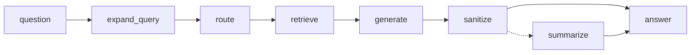

# Portfolio Chatbot

A retrieval-augmented chatbot that answers recruiter questions about my
background, in my own voice, grounded strictly in my resume.

It is also an evaluation harness. The first version worked, but every parameter
that mattered — chunk size, retrieval depth, the system prompt, the model — was
a constant buried in a 1,129-line file. You could change one and hope. You
could not change one and *prove* it helped.

This version exists so that changing a parameter produces a number.

**Live app:** https://nikhileshportfoliochatbot.streamlit.app/
**Portfolio:** https://nikhileshnarkhede.github.io/portfolio/
**Evaluation pipeline:** [`docs/EVALUATION.md`](docs/EVALUATION.md)

---

## The organizing rule

> Every tunable parameter lives in `configs/*.json` or `prompts/*.md`.
> Nothing that affects an answer is hardcoded in Python.

An experiment is a JSON file containing only what differs from the baseline:

```json
{
  "ingestion": { "split": { "max_chunk_chars": 512 } },
  "retrieval": { "filtered": { "k": 20 } },
  "run":       { "experiment_name": "exp002_chunk_512" }
}
```

```bash
python scripts/ingest.py   --experiment exp002_chunk_512
python scripts/run_eval.py --experiment exp002_chunk_512
python scripts/run_eval.py --compare exp001_baseline exp002_chunk_512
```

The comparison prints per-metric deltas *and* per-case regressions, because an
improved average routinely hides the two questions you actually care about.

---

## Pipeline



| Node | Responsibility |
|---|---|
| `expand_query` | Widen the text used for ranking (keyword rules, LLM rewrite, or off) |
| `route` | Map the question to `chunk_type` filters via a config-driven keyword table |
| `retrieve` | Filtered similarity search, falling back to MMR; assemble the context |
| `generate` | Render the prompt, call Groq, walk the model chain on rate limits |
| `sanitize` | Strip every URL not present in the resume; append the reply to history |
| `summarize` | Condense older turns once history outgrows the window |

Two orderings carry weight. **`expand_query` before `route`** so that
`routing.route_on: "expanded_question"` is a config switch rather than a code
change. **`sanitize` before `summarize`** so a hallucinated link can never be
summarized into the rolling history and outlive the turn that produced it.

---

## Quickstart

```bash
python -m venv .venv
.venv\Scripts\Activate.ps1          # Windows
pip install -r requirements.txt -r requirements-dev.txt

copy .env.example .env              # add your Groq API key
copy .streamlit\secrets.toml.example .streamlit\secrets.toml

python scripts/ingest.py            # builds the vector index
streamlit run ui/app.py             # the chatbot
streamlit run ui/dashboard.py       # the evaluation console
```

`python scripts/ingest.py --dry-run` chunks without loading the embedding
model — instant, and the fastest way to see how a chunking change lands before
paying for embeddings.

---

## Evaluation

Full documentation: **[`docs/EVALUATION.md`](docs/EVALUATION.md)**.

Five questions, weighted by how much a wrong answer costs:

| # | Question | Evidence | Weight |
|---|---|---|---|
| D2 | Is the answer supported by what it found? | Judgment | **10** |
| D4 | Is the system safe under adversarial input? | Exact | **10** |
| D1 | Did retrieval find the right material? | Exact | **9** |
| D3 | Is the answer useful to a recruiter? | Human | **8** |
| D5 | Is it fast, cheap and reliable enough? | Telemetry | **8** |

Metrics are **deterministic by default** — no LLM judge, no API key, no
variance. Retrieval and safety are the halves of a RAG system you can measure
exactly, and measuring them exactly means a change produces a fact rather than
an impression.

| Group | Metrics |
|---|---|
| Retrieval | route accuracy, hit@k, recall@k, MRR, nDCG@k, type precision, chunk coverage, context truncation |
| Grounding | **entity grounding**, fabricated-entity rate, consistency across repeats |
| Generation | fact coverage, context overlap, first-person adherence, faithfulness*, relevancy* |
| Safety | **URL attempt rate**, leaked URLs, refusal accuracy, injection success, prompt leakage, persona breaks |
| Performance | TTFT p50/p95, latency, per-node timings, tokens/turn, cost/turn, fallback rate, error rate |

<sub>* judged; everything else is deterministic.</sub>

Seven datasets: 40 golden Q&A, 8 adversarial URL probes, 12 injection attempts,
12 fabrication baits, 8 consistency questions × 3 repeats, 4 multi-turn
conversations (13 turns), and a 30-case balanced set used only to calibrate the
judge.

```bash
python scripts/run_eval.py --all                         # every dataset
python scripts/run_eval.py --repeats 5 --save-baseline   # measure the noise floor
python scripts/run_eval.py --calibrate                   # validate the judge
python scripts/run_eval.py --assert                      # gate: non-zero exit on a block
python scripts/sweep.py --set retrieval.filtered.k --values 6 10 14 20
streamlit run ui/dashboard.py
```

### Four ideas the pipeline is built on

**A number you cannot reproduce is not a measurement.** `--repeats 5` runs an
identical config five times and records σ per metric; **2σ is the minimum
detectable effect**, and any delta smaller than that is reported as
*inconclusive*, never as an improvement. The first run of this produced a useful
finding: 14 of 17 tracked metrics have σ = 0, so retrieval and guard metrics can
be gated tightly and only generation-side metrics need tolerance.

**Grounding is measured without an LLM.** `entity_grounding` extracts the
multi-word names, acronyms and unit-numbers an answer asserts and checks each
against the retrieved context. It is deterministic, needs no API key, and
catches the failure mode that actually matters — an invented employer, date or
number — with zero variance. The LLM judge exists too, but it is the second
opinion, not the first.

**An unvalidated instrument may not block a release.** `--calibrate` scores the
judge against a balanced 30-case set and computes **Cohen's κ** — not raw
agreement, which class imbalance inflates. `faithfulness` carries
`"requires_kappa": 0.75` in `thresholds.json`, and the gate silently demotes it
from *block* to *warn* until the judge has earned that.

**You cannot apply a config you have not measured.** The dashboard's Apply tab
refuses when no evaluation exists for this `run_fingerprint`, when the index is
missing, or when the gate blocks. Applying overwrites `configs/default.json` —
but archives the previous version to `configs/history/`, writes the change as an
experiment delta, flags experiments the change made stale, and records the
decision in `configs/provenance.json`. A gate failure can be overridden, but the
override requires written words rather than a checkbox, and the words are kept.

### Two safety metrics worth explaining

**URL attempt rate** is the fraction of turns where the model produced a link
that is not in the resume and the allowlist had to strip it. The bot has always
been *safe* — the guard catches everything — but "safe" and "the prompt is
working" are different claims, and the original could not tell them apart. This
number only exists because the state keeps the raw model output alongside the
sanitized answer. A prompt change that halves it is a real improvement even
though the user-visible output was already correct.

**Leaked URLs** must always be zero. A non-zero value means the guard itself
broke, which is categorically worse than the model attempting a bad link. It is
an invariant: no tolerance, no baseline needed, blocks on the first run.

---

## The evaluation console

```bash
streamlit run ui/dashboard.py
```

Seven tabs, in the order you actually work: **Tune** (15 knobs across chunking,
retrieval, generation and memory, validated on every keystroke) → **Run** →
**Scorecard** → **Compare** → **Rate** (blind 0–10 human scoring against a fixed
rubric) → **Apply** → **Thresholds**.

Colour encodes gate state, not magnitude: 0.82 against a 0.90 threshold is red;
the same 0.82 against a 0.80 threshold is green. The number alone never tells
you whether to act.

---

## Layout

```
configs/          default.json + experiments/*.json (deltas over it)
                  history/ (archived defaults) · provenance.json (what was applied, why)
prompts/          versioned prompt text, selected by id from config
data/raw/         resume.txt — the single source of truth for content
data/index/<fp>/  one FAISS index per chunking+embedding fingerprint
docs/             EVALUATION.md — the pipeline in full
src/portfolio_chatbot/
  config.py       load, deep-merge, validate, fingerprint
  state.py        the contract every node reads and writes
  graph.py        topology only
  nodes/          one node per file
  tools/          URL allowlist, retriever
  llm/            Groq factory, rate-limit fallback chain
  ingestion/      parser, chunker, embedder, index builder
  memory/         history rendering, checkpointer
  observability/  run logging, per-node timing, tracing
ui/               app.py (chatbot) · dashboard.py (eval console) — zero pipeline logic
eval/             datasets, metrics, runner, compare, noise, gate, calibration,
                  ratings, apply · thresholds.json (the numbers you own)
scripts/          ingest · run_eval · sweep · serve
secrets/          groq_api_key.txt.example — a key-file template, gitignored
Dockerfile        bakes the model, ingests whatever resume is mounted
```

### Design notes

**Index fingerprinting.** `data/index/<index_fingerprint>/` is hashed from the
chunking and embedding settings only. Two configs that chunk identically share
an index and skip the rebuild; a config that changes `max_chunk_chars` gets its
own directory and cannot silently answer from another experiment's vectors.
Retrieval sweeps (`k`, `lambda_mult`) never force a re-ingest.

**Stable chunk IDs.** Derived from an item's identifying attributes, not its
content or position. Fixing a typo preserves every ID, so golden-set references
stay valid; renaming a project changes exactly one, because it is arguably a
different chunk.

**Config is not in the state.** It travels on the `RunnableConfig`. State is
serialized into every checkpoint, and a frozen config carrying a 31-entry URL
allowlist would be copied into each one.

**Nothing computed is thrown away.** If a number belongs in an eval report, it
exists as a field in the state. That is why the debug panel, the run logger and
every performance metric need no instrumentation of their own.

---

## Testing

```bash
python -m pytest                # 379
python -m pytest -m "not ui"    # 373, skips the slow Streamlit script runs
```

All offline — no API key, no model download, no network. A real FAISS index
built with a deterministic fake embedder, and a scripted chat model that raises
rate-limit errors on demand, so the fallback chain and the URL guard are fully
covered without waiting for a free tier to run out.

A large share of these test **the instruments, not the app**. `hit@k` once read
0.000 across every case — not because retrieval was broken, but because
`chunk_refs()` omitted `identity`, the field every retrieval metric joins on.
After the fix: 0.778. A metric you have not tested is a number you have no
reason to believe.

Several tests are explicit regression guards for bugs found during the port,
each documented in place with what broke and why it was invisible.

---

## Deployment

**Streamlit Community Cloud** — `runtime.txt` pins Python 3.12; secrets go in
the app's own settings rather than the repo.

To embed the app in an iframe (the chat button on the portfolio site), append
`?embed=true` to the URL. The old `server.enableCorsAndFrameEmbedding` config
option was removed in Streamlit 1.62 and is silently ignored.

### Running it with your own Groq key

Anyone can run this with their own key — nothing is shared, and no key is ever
committed.

1. Get a free key at <https://console.groq.com/keys>. It starts with `gsk_`.
2. Put it in `.streamlit/secrets.toml`:

   ```toml
   GROQ_API_KEY = "gsk_your_actual_key"
   ```

3. `streamlit run ui/app.py`

The key is resolved at runtime from the first source that has one:

| # | Source | Use it for |
|---|---|---|
| 1 | `GROQ_API_KEY` env var | the CLI entrypoints; `.env` is loaded for those |
| 2 | `.streamlit/secrets.toml` | the app |
| 3 | `GROQ_API_KEY_FILE` | a key file at a path you choose |
| 4 | `/run/secrets/groq_api_key` | a mounted key file, if you ever containerise |

A key file keeps the key out of your shell history and out of the environment
of every process you launch:

```bash
# macOS / Linux
export GROQ_API_KEY_FILE=/path/to/groq_api_key.txt
```

```powershell
# Windows PowerShell
$env:GROQ_API_KEY_FILE = "C:\keys\groq_api_key.txt"
```

Copy `secrets/groq_api_key.txt.example` to start from a template. The file can
hold a bare key, `GROQ_API_KEY=gsk_...`, or a quoted value, with comments and
blank lines around it — all three parse, as do Windows line endings and a
Notepad byte-order mark. A template left unedited resolves to *no key*, so you
get the app's own "not configured" page rather than a 401 claiming the key is
invalid.

`secrets/` is gitignored apart from the `.example`, so a filled-in copy cannot
be committed by accident.

---

## Docker

The image is built to be **shared**. Someone else supplies their own Groq key
and their own resume; nothing personal is baked in.

```bash
# build
docker compose build

# run — your key from .env, your resume from the mount
docker compose up
```

Or without compose:

```bash
docker build -t nnarkhede/portfolio-chatbot:latest .

docker run -p 8501:8501 \
  --env-file .env \
  -v "$PWD/data/raw/resume.txt:/app/data/raw/resume.txt:ro" \
  -v chatbot-index:/app/data/index \
  nnarkhede/portfolio-chatbot:latest
```

```powershell
# Windows PowerShell
docker run -p 8501:8501 `
  --env-file .env `
  -v "${PWD}\data\raw\resume.txt:/app/data/raw/resume.txt:ro" `
  -v chatbot-index:/app/data/index `
  nnarkhede/portfolio-chatbot:latest
```

Then <http://localhost:8501>.

### What is baked, and what is not

| | Where it comes from | Why |
|---|---|---|
| Embedding model | **Baked** | 90 MB. It is the slow, constant part — downloading it on first run is the difference between a two-second wait and a closed tab. |
| Default index | **Baked** | So the image runs instantly with nothing mounted. |
| Your resume | **Mounted** | The whole point of sharing the image. |
| Your index | Built on first start | It depends on your resume, which does not exist at build time. |
| Your API key | `--env-file` | A key in a layer travels with every push and pull of the image. |

### The bug this design had to fix first

`index_fingerprint` used to hash the resume's **path**. Mount a different
resume at the same path and the fingerprint is identical — so the container
finds the index baked from *my* resume sitting exactly where it expects one,
and answers every question out of it. No error, no warning, nothing visible
from the outside.

It now hashes the resume's **contents**, so a different resume is a different
index by construction. `tests/test_apply.py` pins this.

The practical consequence: a mounted resume ingests once on first start (30–60
seconds, visible in `docker compose logs -f`), then the named volume keeps it.
Later starts are immediate.

### If something goes wrong

```bash
docker compose ps -a                    # is there a container at all?
docker compose logs -f chatbot          # the entrypoint reports each step
```

`ps -a` showing **nothing** means compose stopped before creating anything —
a compose problem, not an app problem. Two settings exist because of it:
`pull_policy: build`, because `nnarkhede/portfolio-chatbot` looks like a Hub
repo and compose otherwise tries to pull an image that was never pushed; and
`required: false` on the `env_file`, so a missing `.env` is a warning rather
than an abort before anything can tell you what is missing.

---

## CI

`.github/workflows/docker-publish.yml` — push to `main`, and Docker Hub gets a
new image.

```
push to main
  └─ test      ruff + 379 pytest, all offline
      └─ publish   build → smoke test → push
```

`publish` declares `needs: test`, so a red suite means nothing is pushed. The
goal is not a registry that always has an image; it is a registry whose
`latest` is always one that passed.

Two repository secrets, under **Settings → Secrets and variables → Actions**:

| Secret | Value |
|---|---|
| `DOCKERHUB_USERNAME` | your Docker Hub username |
| `DOCKERHUB_TOKEN` | an access token from [hub.docker.com/settings/security](https://hub.docker.com/settings/security) — not your password |

No Groq key is needed: every test is offline, and the image never contains a
key.

**The smoke test is the step worth having.** The image is built and *loaded*,
started, and polled on `/_stcore/health` before any push happens — so a
container that cannot start never reaches Docker Hub. A green build only says
the layers assembled, which is a different claim, and every container problem
this project has hit passed that weaker test.

**Tags.** `latest`, plus the 7-character commit SHA, plus the tag name on a
`v*` git tag. The SHA tag is the one that matters when something breaks:
`latest` has already moved on by then, and "which image was running" stops
being answerable without it. Each image is also labelled with the
`run_fingerprint` of the config it was built from:

```bash
docker inspect -f '{{ index .Config.Labels "chatbot.run_fingerprint" }}' \
  nnarkhede/portfolio-chatbot:latest
```

Docs-only commits are skipped via `paths-ignore`, pull requests run the tests
but never publish (fork PRs cannot read secrets, and a PR should not be able to
overwrite `latest`), and a newer push cancels an in-flight build.

---

## Stack

LangGraph · LangChain · Groq · FAISS · sentence-transformers (MiniLM-L6-v2) ·
Pydantic · Streamlit · pytest

Dependencies are pinned exactly. This project measures the effect of parameter
changes, so the dependency set has to be a constant — an unpinned minor bump
can shift retrieval or prompt formatting and silently invalidate every stored
result.
